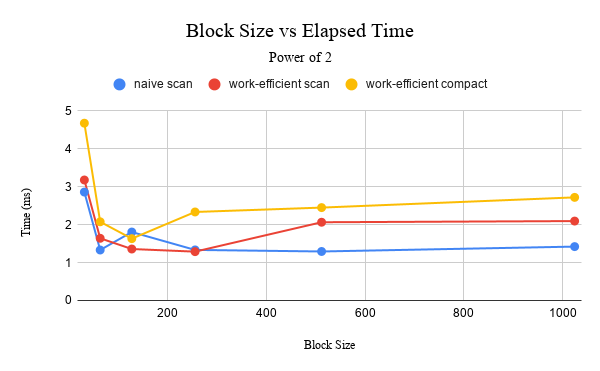
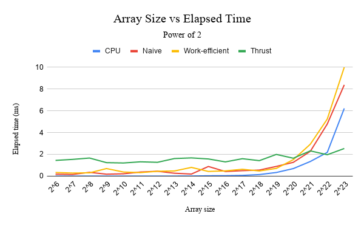
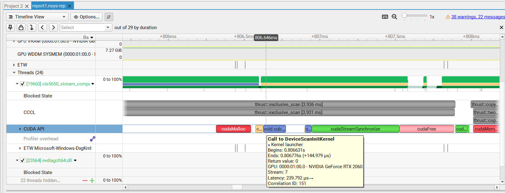
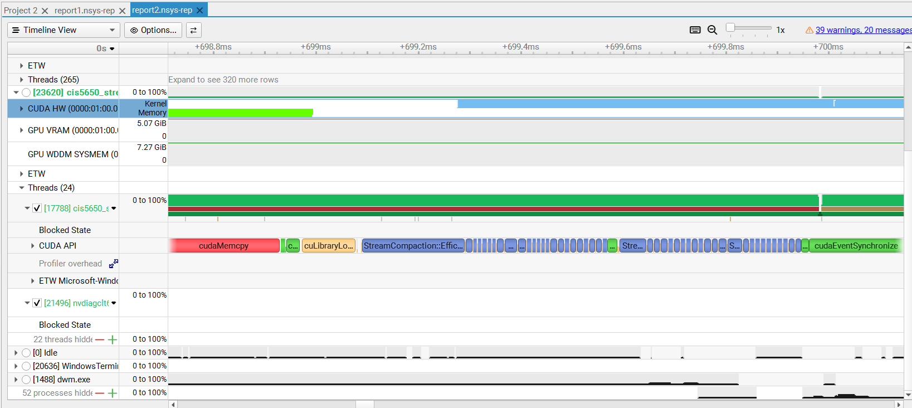

CUDA Stream Compaction
======================

**University of Pennsylvania, CIS 565: GPU Programming and Architecture, Project 2**

* Walson Li
  * [LinkedIn](https://www.linkedin.com/in/walsonli), [personal website](https://www.walsonli.com)
* Tested on: Windows 11 Home, i5-10300H @ 2.50GHz, RTX 2060 6GB (Personal Laptop)

I added a `/Zc:preprocessor` block at the end of CMakeLists.txt due to a cuda version issue.
This code block is from this thread on Ed: [Required cmake change for CUDA 13.2+ #33](https://edstem.org/us/courses/101383/discussion/8243429).

### Parts 1 to 4 results

Default test results:
```
****************
** SCAN TESTS **
****************
    [   8  15  38   6  10   1  34  48   1  45  10  43  20 ...  29   0 ]
==== cpu scan, power-of-two ====
   elapsed time: 0.0004ms    (std::chrono Measured)
    [   0   8  23  61  67  77  78 112 160 161 206 216 259 ... 6120 6149 ]
==== cpu scan, non-power-of-two ====
   elapsed time: 0.0003ms    (std::chrono Measured)
    [   0   8  23  61  67  77  78 112 160 161 206 216 259 ... 6004 6037 ]
    passed
==== naive scan, power-of-two ====
   elapsed time: 0.150272ms    (CUDA Measured)
    passed
==== naive scan, non-power-of-two ====
   elapsed time: 0.120448ms    (CUDA Measured)
    passed
==== work-efficient scan, power-of-two ====
   elapsed time: 0.342016ms    (CUDA Measured)
    passed
==== work-efficient scan, non-power-of-two ====
   elapsed time: 0.129376ms    (CUDA Measured)
    passed
==== thrust scan, power-of-two ====
   elapsed time: 1.17245ms    (CUDA Measured)
    passed
==== thrust scan, non-power-of-two ====
   elapsed time: 0.051488ms    (CUDA Measured)
    passed

*****************************
** STREAM COMPACTION TESTS **
*****************************
    [   2   3   2   0   0   1   2   0   3   1   0   3   0 ...   3   0 ]
==== cpu compact without scan, power-of-two ====
   elapsed time: 0.0008ms    (std::chrono Measured)
    [   2   3   2   1   2   3   1   3   1   1   3   1   3 ...   1   3 ]
    passed
==== cpu compact without scan, non-power-of-two ====
   elapsed time: 0.0006ms    (std::chrono Measured)
    [   2   3   2   1   2   3   1   3   1   1   3   1   3 ...   3   1 ]
    passed
==== cpu compact with scan ====
   elapsed time: 0.0051ms    (std::chrono Measured)
    [   2   3   2   1   2   3   1   3   1   1   3   1   3 ...   1   3 ]
    passed
==== work-efficient compact, power-of-two ====
   elapsed time: 0.334176ms    (CUDA Measured)
    passed
==== work-efficient compact, non-power-of-two ====
   elapsed time: 0.3944ms    (CUDA Measured)
    passed
```

#### Block size vs elapsed time

Naive scan, and work-efficient scan/compact are included because they have adjustable block sizes. The times below are in ms.



| Block size | Naive Scan | Work-efficient Scan | Work-efficient Compact |
|-|-|-|-|
| 32 | 2.85741 | 3.17568 | 4.67293 |
| 64 | 1.3297 | 1.63859 | 2.07328 |
| 128 | 1.80358 | 1.35578 | 1.62931 |
| 256 | 1.33213 | 1.28656 | 2.33238 |
| 512 | 1.29101 | 2.06179 | 2.44774 |
| 1024 | 1.41949 | 2.09242 | 2.71725 |

The best time for the naive scan was at block size 512.
Meanwhile the work-efficient scan was best at block size 256,
and the work-efficient compact was best at block size 128.

#### Array size vs elapsed time

Here are the elapsed times based on some array sizes. 
The naive and work-efficient scans are using their optimized block sizes (512 and 256, respectively).
Times shown are in ms.

| Array size | CPU | Naive (512) | Work-efficient (256) | Thrust |
|-|-|-|-|-|
|2^6	|0.0001	|0.178528	|0.333824	|1.44189   |
|2^7	|0.0004	|0.151552	|0.282624	|1.53606   |
|2^8	|0.0005	|0.348384	|0.303072	|1.66122   |
|2^9	|0.0005	|0.17728	|0.694208	|1.23763   |
|2^10	|0.0007	|0.2128	    |0.376832	|1.20579   |
|2^11	|0.0012	|0.377088	|0.321504	|1.31466   |
|2^12	|0.0025	|0.44832	|0.44256	|1.26819   |
|2^13	|0.0046	|0.26624	|0.473248	|1.61392   |
|2^14	|0.0083	|0.188832	|0.800768	|1.67302   |
|2^15	|0.032	|0.885696	|0.428992	|1.57571   |
|2^16	|0.0381	|0.423264	|0.48128	|1.30666   |
|2^17	|0.0663	|0.499712	|0.63008	|1.59994   |
|2^18	|0.1421	|0.556544	|0.472928	|1.42      |
|2^19	|0.3333	|0.890912	|0.70848	|1.99162   |
|2^20	|0.6918	|1.26493	|1.51194	|1.64419   |
|2^21	|1.3428	|2.27251	|2.92621	|2.31872   |
|2^22	|2.177	|4.78576	|5.23882	|1.96192   |
|2^23	|6.2156	|8.37635	|9.99299	|2.53469   |



This was surprising for me because I expected the gpu methods to be faster than the cpu one at large array sizes.
On the contrary, it seems like cpu is consistently faster than the two gpu algorithms,
and the work-efficient algorithm is even slower than the naive algorithm.

The Thrust method was the only consistent one because although it elapsed more time with smaller array sizes,
the tests with large array sizes didn't change the elapsed time much.
It even beat out the cpu method, which the gpu methods could not do.

#### Nsight analysis

To see why Thrust ends up outperforming my implementations at large array sizes, I ran it in Nsight.
Zooming in, this is what happens for Thrust:



As a comparison, this is what I found for the work-efficient program:



The work-efficient (and naive) do a lot of kernel calls that run one after the other.
Thrust doesn't have nearly as many kernel calls.
This is probably what is causing the overhead, because my gpu implementations had to wait for the previous kernel to finish running.

Something also worth noting is that thrust does the `cudaMalloc` inside the timer.
That's probably what's making it have such a long runtime for shorter array lengths,
since the other timers don't include the cuda memory functions.
